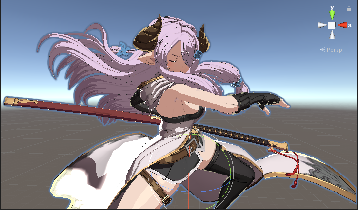
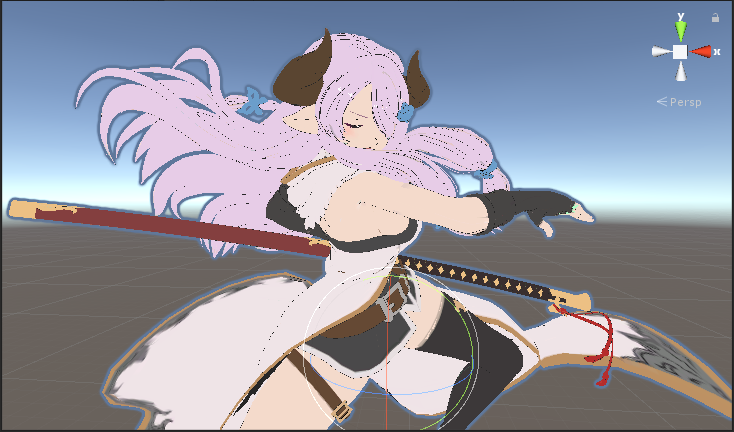
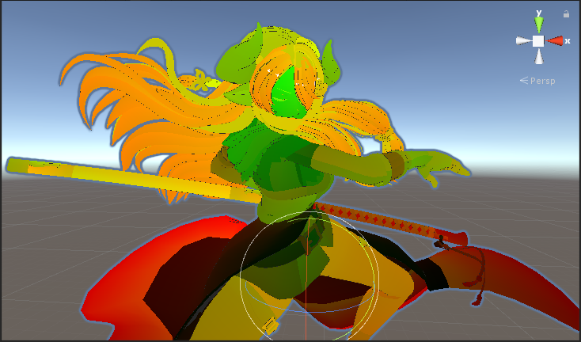
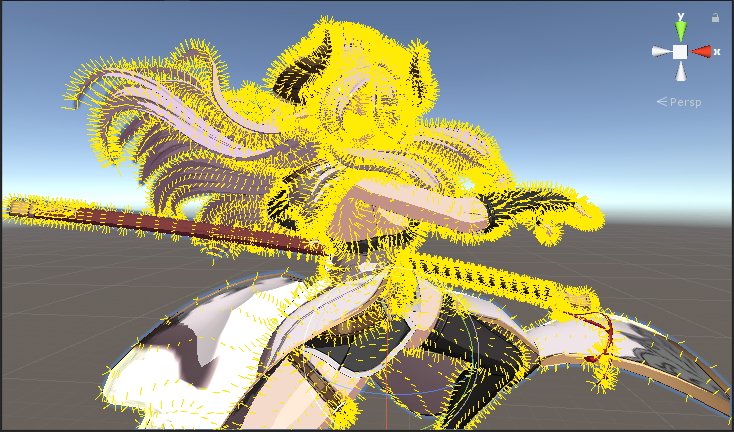
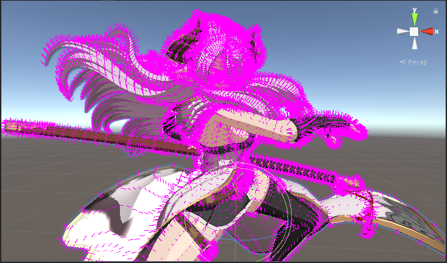

# Mesh Property Viewer

[中文版說明](./README_tc.md)

Visualization of Unity Mesh properties in scene.

## Usage

Add `MeshPropertyViewer` to gameobject that has MeshRenderer or its parent and then selected.

## Mesh Property

<table>
    <tr>
        <td>None</td>
        <td>Color</td>
    </tr>
    <tr>
        <td></td>
        <td></td>
    </tr>
    <tr>
        <td>Texture</td>
        <td>UV</td>
    </tr>
    <tr>
        <td></td>
        <td></td>
    </tr>
    <tr>
        <td>Normal</td>
        <td>Tangent</td>
    </tr>
    <tr>
        <td></td>
        <td></td>
    </tr>
</table>