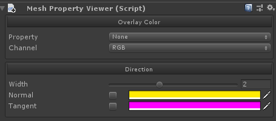
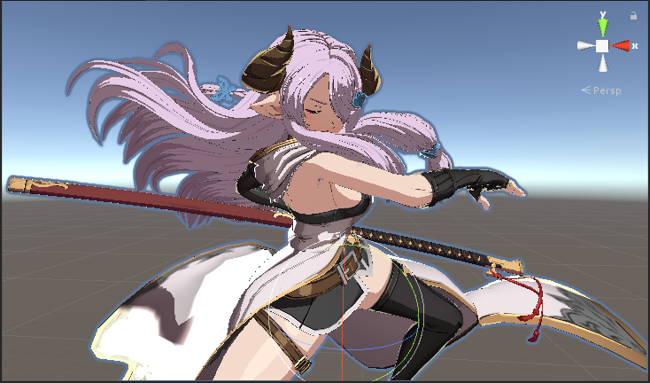
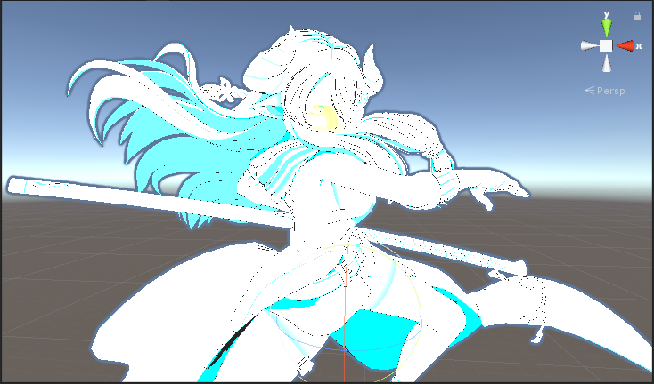
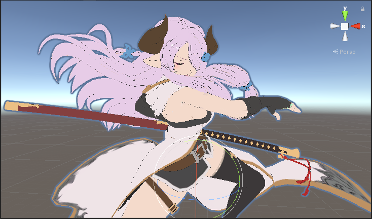
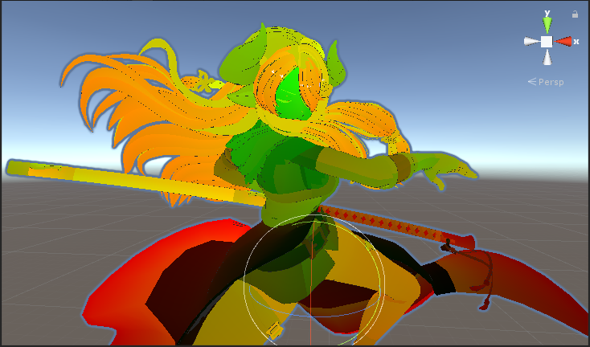
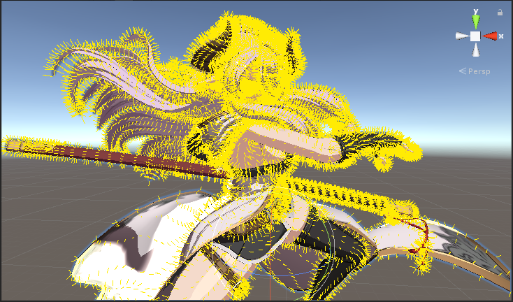
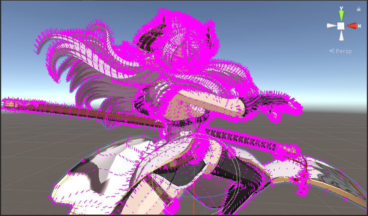

# Mesh Property Viewer

在場景中視覺化顯示Unity Mesh屬性

## 相容性

目前僅測試過以下版本，但也可能兼容其他版本

| 版本
|------
| Unity 2018.4.x
| Unity 2020.3.x

## 使用方法

+ 使用本專案或複製`Assets/MeshPropertyViewer`到你的專案

+ 在擁有Mesh或其上層物件上添`MeshPropertyViewer`腳本並選取

## Mesh屬性

+ Narmaya © Cygames, Inc

<table>
    <tr>
        <td>None</td>
        <td>Color</td>
    </tr>
    <tr>
        <td></td>
        <td></td>
    </tr>
    <tr>
        <td>Texture</td>
        <td>UV</td>
    </tr>
    <tr>
        <td></td>
        <td></td>
    </tr>
    <tr>
        <td>Normal</td>
        <td>Tangent</td>
    </tr>
    <tr>
        <td></td>
        <td></td>
    </tr>
</table>